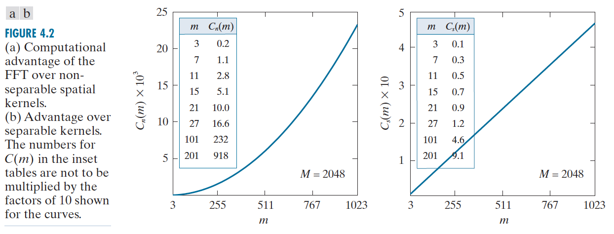
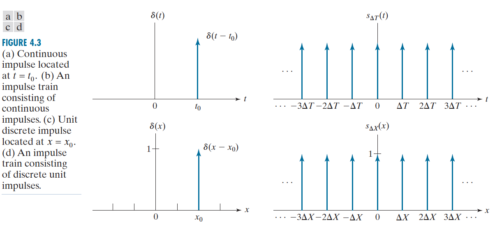
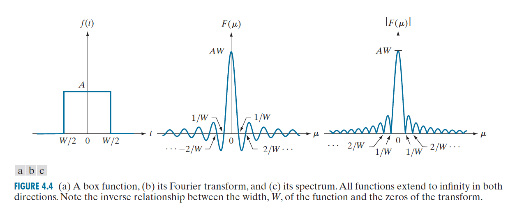

# Fourier Series & Transform

* A function, expressed in fourier series/transform, can be reconstructed completely vie an inverse process with no loss of information.

**Allows us to work in the Fourier domain (generally called the frequency domain) and then return to the original domain of the function
without losing any information**

### Fourier Series
" Any **periodic** function can be expressed as the **sum of sines and/or cosines** of different frequencies, each **multiplied by a different coefficient** "

### Fourier Transform
Functions that are **not periodic** (but whose area under the curve is finite) can be expressed as the **integral** of sines and/or cosines **multiplied by a weighting function**

#### Computational Advantage (Filtering) in Frequency Domain

Image size (M x N), Kernel size (m x n)

**Non-Separable Kernel**

1. Spatial Domain:  $MNmn$
2. Frequency Domain: $2MN\log_2MN$

**Separable Kernel**
1. Spatial Domain: $MN(m+n)$
2. Frequency Domain: $2MN\log_2MN$

 

 

### Impulses

 

$$
\delta(x) = \begin{cases}
    \infty &  t = 0 \\
    0 & t \neq 0
   \end{cases}
$$
where $\int_{-\infty}^{\infty} \delta(t)dt = 1$

#### Sifting

Yields the value of function f(t) at the location of the impulse
$$ \int_{-\infty}^{\infty} f(t)\delta(t-t_{0})dt = f(t_{0})$$

#### Impulse Train
Consist of continuous impulses
$$
s_{\Delta T}(t) = \sum_{k=-\infty}^{\infty} \delta(t-k\Delta T)
$$

 

### Fourier Transformation

**Continuous Variable**
$$
F(\mu) = \int_{-\infty}^{\infty} f(t)e^{-j2\pi \mu t}dt
$$

Inverse Fourier
$$
f(t) = \int_{-\infty}^{\infty} F(\mu)e^{j2\pi \mu t}d\mu
$$

where $\mu$ is the frequency of the sine & cosine term

E.g

