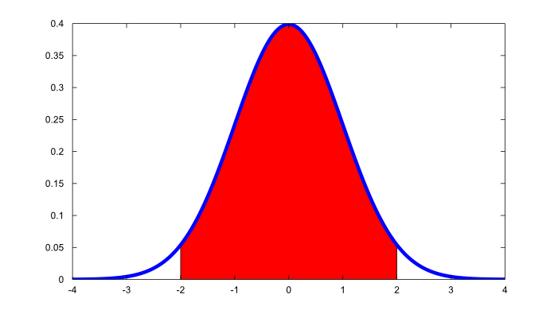
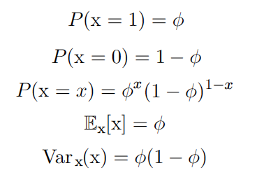
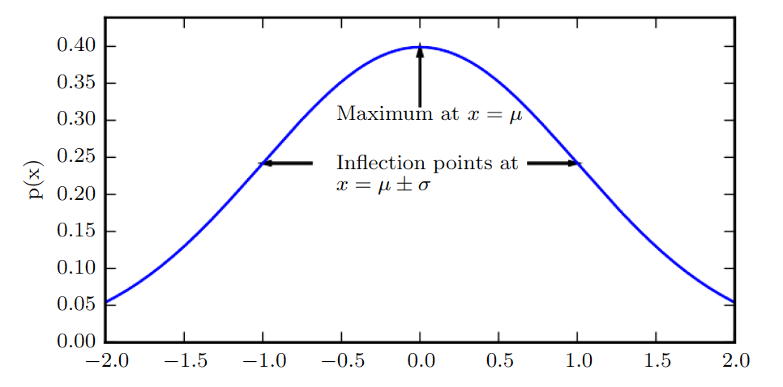
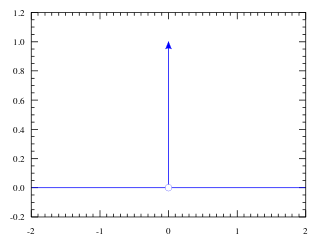
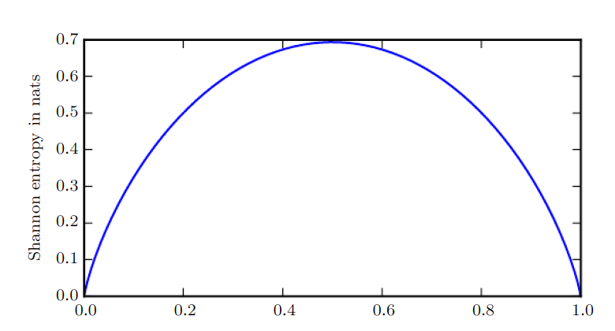

# Probability and Information Theory

**Probability theory** a mathematical framework for representing uncertain statements.

#### Why Probability in ML ?
1. Deal with uncertain quantities
2. Deal with stochastic quantities

#### Types of Probability
1. Frequentist probability
2. Bayesian probability

 

### Probability Distribution
How likely a random variable takes on each of the possible states.

#### Discrete Variables
Described using **Probability mass function (PMF)**, _P_. It maps from a state of a random variable to the probability of that random variable taking on that state.

#### Continuous Variable
Described using **Probability density function (PDF)**
- Integrate density function to find actual probability mass of a set of points

 

### Marginal Probability
Probability distribution over a subset of variables

**Sum Rule (discrete)**
$$ \forall x \in \text x, P(\text x = x) = \sum_y P(\text x = x, \text y = y)
$$

**Continuous**
$$ p(x) = \int p(x,y)dy $$

 

### Conditional Probability

$$ P(y=\text y | x=\text x) = \frac{P(\text y = y, \text x = x)}{P(\text x = x)} $$

 

### Chain Rule of Conditional Probability
$$
P(x^1,...,x^n) = P(x^1)\prod_{i=2}^nP(x^i|x^1,..,x^{(n-1)})
$$
Decompose joint probability distribution over many random variable into conditional distribution over one variable.

 

### Independence & Conditional Independence

**Independent**
$$ \forall x \in \text x, y \in \text y,  p(\text x = x, \text y = y) = p(\text x = x)p(\text y = y)
$$

**Conditionally Independent**
$$ \forall x \in \text x, y \in \text y, z \in \text z, p(\text x = x, \text y = y | \text z = z) = p(\text x = x | \text z = z)p(\text y = y | \text z = z)
$$

### Expectation, Variance, Covariance

#### Expectation

Discrete Variables
$$ \mathbb E_{xP} |f(x)| = \sum_x P(x)f(x) $$

Continuous Variables
$$ \mathbb E_{xP} |f(x)| = \int p(x)f(x)dx $$

#### Variance
$$
Var(f(x)) = \mathbb E[f(x) - \mathbb E[f(x)]^2]
$$

#### Covariance
Indicate how much two values are linearly related to each other, as well as scale of these variables
$$
Cov(f(x),g(y)) = \mathbb E[(f(x)-\mathbb E[f(x)])(g(y)-\mathbb E[g(y)])]
$$

### Common Probability Distribution

#### Bernoulli Distribution
- Distribution over a single **binary** random variable

Controlled by parameter $\phi \in [0,1]$
 which gives probability of random variable = 1

#### Multinoulli Distribution
- Distribution over a **single discrete** variable with *k* different state

#### Gaussian Distribution

**Why Gaussian is good choice for real number distribution without prior knowledge?**
1. Central Limit Theorem
- sum of many independent random variables is approximately normally distributed.
2. Encodes maximum amount of uncertainty over real number

### Exponential & Laplace Distribution
In deep learning, want to have probability distribution with a sharp point at *x* = 0

#### Exponential
$$ p(x;\lambda) = \lambda1_{x\geq0}exp(-\lambda x)
$$
#### Laplace
$$ Laplace(x;\mu,\gamma) = \frac{1}{2\gamma} exp(-\frac{|x-\mu|}{\gamma})
$$
$\gamma$  denotes the spread of distribution

#### Dirac & Empirical Distribution
All the mass in a probability distribution clusters around a single point
$$ p(x) = \delta(x-\mu) $$
Zero-valued everywhere except 0

### Bayes' Rule
$$
P(x|y) = \frac{P(x)P(y|x)}{P(y)}
$$

 

### Information Theory
**Intuition**
1. Likely events should have low information content
2. Less likely events should have higher information content
3. Independent events should have additive information

**Self information** of an event x = $x$ :
$$ I(x) = -logP(x) $$
Where log represents natural log *e*.
*I(x)* written in units of **nats**, 1 nat = information gained by observing an event of probability $\frac{1}{e}$

#### Shannon Entropy
Quantify amount of uncertainty in an entire probability distribution
$$
H(x) = \mathbb E_{x~P}[I(x)] = -\mathbb E_{x~P}[logP(x)]
$$

Shannon entropy of a distribution is the expected amount of information in an event drawn from that distribution

The plot shows how distribution closer to deterministic have low Shannon entropy
