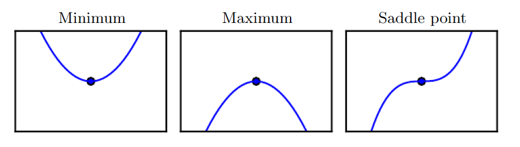

# Numerical Computation

Nature of Machine Learning computation: Solving mathematical problems iteratively (update estimates) of the solution
e.g
1. Optimization
2. Solving systems of linear equations

#### Underflow
Numbers near zero are rounded to zero.

#### Overflow
Large numbers approximated as $\inf$

#### Poor Conditioning
Functions that change rapidly when their inputs are perturbed slightly

### Gradient-Based Optimization

**Objective Function** : function we want to minimize / maximize

**Derivative**
$$
\lim_{h \to 0} \frac{f(a+h) - f(a)}{h}
$$

