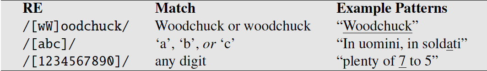

# 2. Regrex, Text Normalization, Edit Distance

## Regular Expression
_Algebraic notation for characterizing a set of strings._

Involves having a pattern to search for, and a corpus (a collection of computer-readable text) of text to search through.

### Regrex Patterns

#### Anchor
Anchor regrex to particular place in string

**^** : 1. matches start of string
2. Negation (if it comes after the opening bracket)
3. Represent ^

**$** : match end of string

**\b..\b** : word boundary (*word* defined as sequence of digits, underscores or letters)

#### Disjunction, Grouping and Precedence

**|** : disjunction operator

**()** : parenthesis operator; enclosed pattern act like character

##### Operator Precedence Hierarchy

_Regrex are greedy; always match largest string_

_Non-greedy_: add ? behind * / +

#### Error Rates
1. False Positive (increase Precision)
2. False Negative (increase Recall)

#### Substitution, Capture Groups
e.g _([0-9]+)/<\1>_ 
**\1 operator** is used to refer back to first pattern enclosed by ()

**Capture Group:** use of () to store pattern in memory (register)

e.g _the (.*)er they were, the \1er they will be_  
set constraint for same string

**Non-Capturing group:** (?: pattern)  
eg. _(?:some|a few) (people|cats) like some \1_  
Match some cats like some cats but not some cats like some a few.

**Look-ahead assertions :** (?= pattern) is true if pattern occurs, but match pointer doesn't advance

 
 
 

## Words

**Utterance** (2 kinds of disfluencies)

1. fragment : broken-off word
2. fillers : uhm, uh etc

**Lemma**  
a set of lexical forms having the same stem, the same major part-of-speech, and same word sense

**Types** 
number of distinct words |V|

**Tokens** 
total number N of running words

**Wordform** 
fully inflected form of the word

 

#### Herdan's Law
states the relationship between types |V| & number of tokens N.

$$|V| = kN^{\beta}$$

where $k$ and $\beta$ are positive constant, 0 < $\beta$ < 1

 

**Word Variation**
1. Language
2. Genre

 

### Text Normalization
Essential before any language processing of the text

1. Tokenization
2. Normalizing
3. Segmenting sentences

**Clitic** : a part of a word that can't stand on its own, can only occur when it is attached to another word. _e.g we're, what's_

##### Common tokenization standard
Penn Treebank tokenization

#### Word Segmentation
**Problems**: some languages (Chinese Japanese) does not use space to mark separate words

**Solution**: Maximum-Matching (requires dictionary)

**Metric** : Word error rate, compute using normalised minimum edit distance (output vs actual)  
**Minimum edit distance:** Number of word insertion, deletion, and substitution, divided by length of golden sentence in words

#### Lemmatization & Stemming

**Lemmatization** is the task of determining that two words have the same root, despite their surface differences

Sophisticated method of Lemmatization involves morphological parsing.
**Morphology** is the study of
morpheme the way words are built up from smaller meaning-bearing units called **morphemes**

**Morphemes**
1. Stems : central morpheme of word, supplying main meaning
2. Affixes : adding 'additional' meaning of various kinds

e.g A morphological parser takes a word like cats and parses it into the two morphemes _cat_ and _s_

**Stemming**
mainly consists of chopping off word-final affixes
 
e.g Porter Stemmer

#### Byte-Pair Encoding
Tackle the problem of unknown words, words that a system has not seen before
 
Intuition of the algorithm is to iteratively merge frequent pairs of characters

#### Sentence Segmentation
In general, sentence tokenization methods work by building a binary classifier (based on a sequence of rules or on machine learning) that decides if a period is part of the word or is a sentence-boundary marker.

### Minimum Edit Distance
**Definition**: minimum number of editing operations (insertion, deletion, substitution) needed to transform one string into another.

Uses dynamic programming: large problems solve by combining solutions to sub problem.

Usefulness:
1. Spelling error correction
2. Provide minimum cost alignment between 2 strings

**Algorithm**

