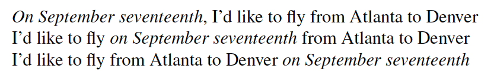
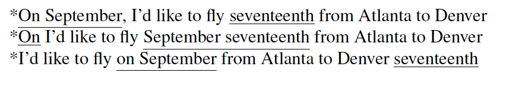
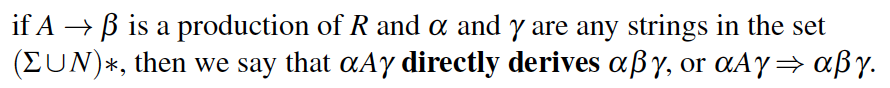
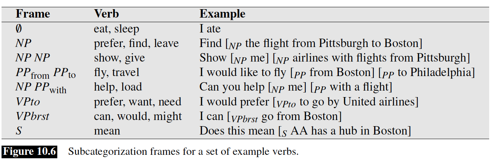
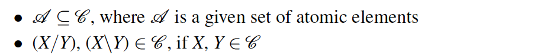
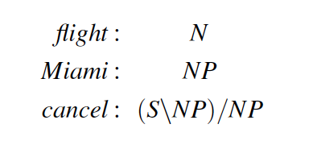

# Formal Grammer

**Syntax**: refers to the way words are arranged together

#### Constituency
Group of words behaving as a single unit

**Noun Phrase**
- Sequence of words surrounding a noun (head, modifiers)  
**Evidence for constituency**
- all appear in similar syntactic environment
- Preposed (BOS) / Postposed (EOS) construction

* Individual fragments does not hold

 

### Context-Free Grammer (CFG)
For modeling constituent structure. Consist of a set of rules which express the way symbols of the language can be grouped or ordered together.

**Formal Definition**

* Rule expansion -> Derivation of a string of words (Parse tree)

* Formal language defined by CFG is a set of strings derivable from start symbol

* Sentences derived by grammar -> formal language defined by the grammar -> grammatical sentences

 

##### Derivation

### Grammar Rules in English

#### Sentence-Level Construction

1. Declarative: subject NP followed by VP
2. Imperative: Start with VP, and no subject
3. Yes-No Question: Begins with auxiliary verb, followed by subject NP, followed by VP
4. Wh-Questions: Similar to declarative, but first NP contains wh-word

**Verb Phrase**: Consist of verb and a number of other constituents

**Subcategorization Frame**: possible sets of complements

#### Grammar Equivalence & Normal Form

**Strong Equivalence**: Generate same strings & assign same phrase structure to each sentence
**Weak Equivalence**: Only generate same strings

 

**Chomsky Normal Form** (Binary Branching)
RHS of each rule
- 2 non-terminal symbols
- 1 terminal symbols

So far, grammar presented emphasise phrase structure rules, minimizing the role of lexicons.

 

### Lexicalized Grammar

#### Combinatory Categorical Grammar
Elements
1. A set of categories

2. A lexicon that associates words with categories

3. Set of rules that govern how categories combine in context

