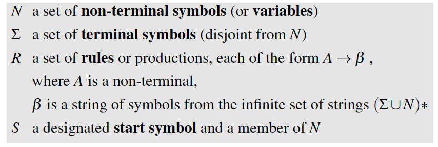

# Formal Grammer

**Syntax**: refers to the way words are arranged together

#### Constituency
Group of words behaving as a single unit

**Noun Phrase**
- sequence of words surrounding a noun  
**Evidence for constituency**
- all appear in similar syntactic environment
- Preposed (BOS) / Postposed (EOS) construction

* Individual fragments does not hold

 

### Context-Free Grammer (CFG)
For modeling constituent structure. Consist of a set of rules which express the way symbols of the language can be grouped or ordered together.

**Formal Definition**

* Rule expansion -> Derivation of a string of words (Parse tree)

* Formal language defined by CFG is a set of strings derivable from start symbol

* Sentences derived by grammar -> formal language defined by the grammar -> grammatical sentences

 

##### Derivation

### Grammar Rules in English

#### Sentence-Level Construction

1. Declarative: subject NP followed by VP
2. Imperative: Start with VP, and no subject
3. Yes-No Question: Begins with auxiliary verb, followed by subject NP, followed by VP
4. Wh-Questions: Similar to declarative, but first NP contains wh-word
