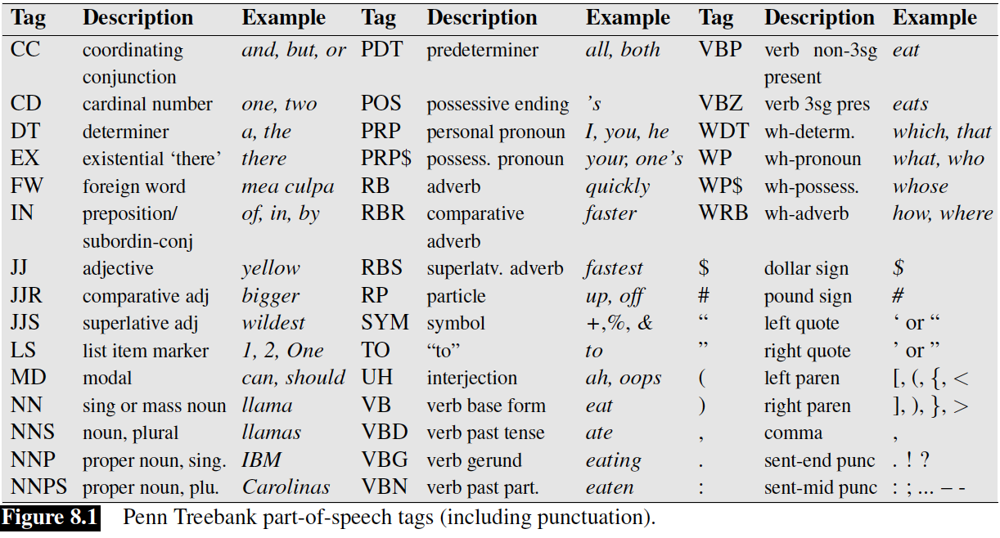

# Part-of-Speech Tagging

POS can be divided into two categories
1. **Closed class** (relatively fixed membership)
2. **Open class** (continually being created; nouns)

### 4 Major Open Class

#### Nouns
Definition in English
* Ability to occur with determiner
* Take possessive
* Occur in plural form (not all)

**Proper Noun**  
Generally aren't preceded by article.  
Usually capitalised

**Common Noun**  
1. Count noun
2. Mass noun

#### Verbs
Actions and proceses

#### Adjectives
Properties and qualities

#### Adverbs
* Directional (*here, below*)
* Degree (*extremely, somewhat*)
* Manner (*slowly, delicately*)

 

### Closed Class

#### Preposition
Occur before noun phrases, indicate spatial or temporal relation

#### Particle
Resembles preposition or adverd, used in combination with verb

#### Determiner
Occurs with noun, precedes it

#### Conjunction
Joins two phrases, clauses or sentences
1. Coordinating (*and, or but*)
2. Subordinating (*that*)

#### Pronouns
Referring to some noun phrase or entity or event
1. Personal (*he, she, me*)
2. Possessive (*my, your, their*)
3. Wh- (*what, who, whoever*)

### Penn Treebank POS Tagset

